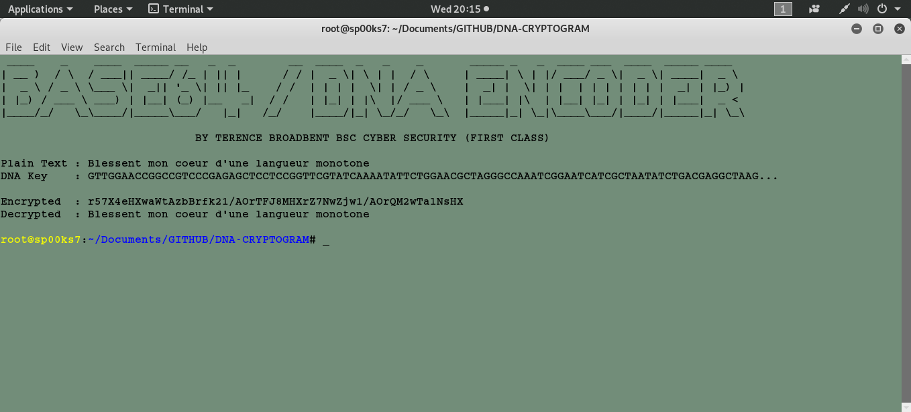

# DNA-CRACKER
Python script file to encrypt and decrypt DNA crytograms.

| LANGUAGE | FILENAME | MD5 Hash |
|------    |------    | -------  |
| python | dna_cracker.py | MD5 Hash - b316a57b6a43f85ed500b2fed11203dd |

 

DNA encryption algorithm
'************************'

A cryptographic technique in which each letter of the alphabet is converted into a different combination of the four bases A,C,T,G that make up the human deoxyribonucleic acid (DNA).

Step 1: Convert each ASCII value to its 8-bit binary value.
Step 2: Convert each binary value to an A,C,T,G combination using a mapping like this {"00":"A", "01":"C", "10":"G", "11":"T"}
Step 3: Construct a random table that represent all the 256 different possible quartet combinations of A,C,T,G (4^4 == 256 == the number of Extended ASCII characters) and use this substitution table to convert each ACTG quartet to an Extended ASCII character (this forms the encrypted message).

EXAMPLE: BOY
************
ASCII values OF B=66, O=79, Y=89

1. ASCII value of B to binary is 01000010
                  O to binary is 01001111
                  Y to binary is 01011001
                  
2. 01000010 => 01=C, 00=A, 00=A, 10=G
   01001111 => 01=C, 00=A, 11=T, 11=T
   01011001 => 01=C, 01=C, 10=G, 01=C
   This means it will become CAAG, CATT, CCGC
   
3. Now let's say that in the 256 random combinations table:
   ......
   Position 53: CAAG
   ......
   Position 67: CATT
   ......
   Position 89: CCGC
   The encrypted message is CAAG -> 53 ->

## CONSOLE DISPLAY

