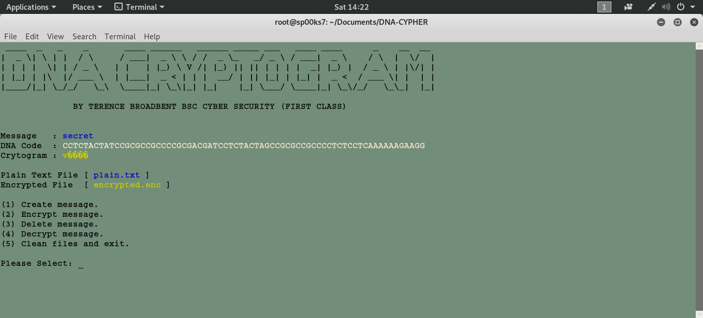

# DNA BASED CRYPTOGRAMS
A python script file to encrypt and decrypt DNA based crytograms.

| LANGUAGE | FILENAME | MD5 Hash |
|------    |------    | -------  |
| python | dna_cryptograms.py | fccc99242a194e644646e6d2dcc0b34d |

DNA encryption algorithm
------------------------
A cryptographic technique in which each letter of the alphabet is converted into a different combination of the four bases A, C, T, G that make up the human deoxyribonucleic acid (DNA).

Step 1: Convert each ASCII value to its 8-bit binary value. 
Step 2: Convert each binary value to an A, C, T, G combination using mapping - 00:A, 01:C, 10:G, and 11:T. 
Step 3: Construct a random table that represent all 256 different possible quartet combinations of A, C, T, G (4^4 = 256 = the number of Extended ASCII characters). Use this substitution table to convert each 'ACTG' quartet to an Extended ASCII character (this then forms the encrypted message).

## CONSOLE DISPLAY

EXAMPLE: BOY
************
ASCII values OF B=66, O=79, Y=89

1. ASCII value of B to binary is 01000010 
                  O to binary is 01001111 
                  Y to binary is 01011001 
                  
2. 01000010 => 01=C, 00=A, 00=A, 10=G 
   01001111 => 01=C, 00=A, 11=T, 11=T 
   01011001 => 01=C, 01=C, 10=G, 01=C 
   
   This means it will become CAAG, CATT, CCGC
   
3. Now let's say that in the 256 random combinations table:
   ......
   Position 53: CAAG 
   ......
   Position 67: CATT 
   ......
   Position 89: CCGC 
   
   The encrypted message is CAAG -> 53 -> 5 etc.
